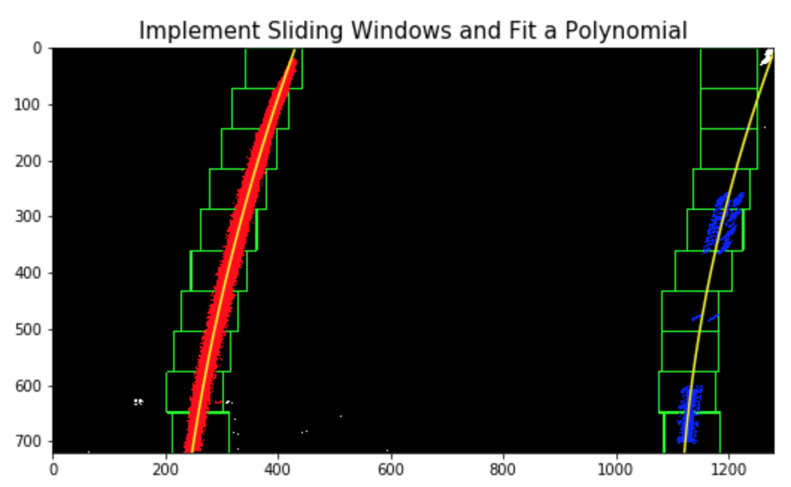

# **Advanced Lane Finding** 
[](http://www.udacity.com/drive)

---

### **Advanced Lane Finding Project**

The aim of this project is to develop a pipeline to detect lane lines on the road with the video stream from the forward facing camera. <br>
* Language/Library: Python, [OpenCV](https://opencv.org/), Numpy, [MoviePy](http://zulko.github.io/moviepy/)
* Data: Vidoe Stream from Camera mounted on the front of Car (mp4)
* Output: Video File (mp4)
  - The Detected Lane Lines, color shaded
  - Radius of Curvature of the Road
  - Center Offset, location of the vehicle from the center of the lane

<br />

---
**The goals/steps of this project are the following:**
* Compute the camera calibration matrix and distortion coefficients given a set of chessboard images.
* Apply a distortion correction to raw images.
* Use color transforms, gradients, etc., to create a thresholded binary image.
* Apply a perspective transform to rectify binary image ("birds-eye view").
* Detect lane pixels and fit to find the lane boundary.
* Determine the curvature of the lane and vehicle position with respect to center.
* Warp the detected lane boundaries back onto the original image.
* Output visual display of the lane boundaries and numerical estimation of lane curvature and vehicle position.

---
### **The steps of this project are the following:**

#### Step 1: Camera Calibration & Undistortion Image
This is the step to make 2D plane images from 3D images in real world space.<br>
In the real world, images are distorted, so making images into 2D place by calculating the [camera calibration](https://docs.opencv.org/2.4/doc/tutorials/calib3d/camera_calibration/camera_calibration.html) matrix and distortion coefficients.<br>
- **Image -> Camera Calibration -> Undistortion Image**
Using cessboard images to get camera calibration matrix (mtx) and distortion coefficients (dist). 
    - First, identify the locations of corners on the chessboard images with [`cv2.findChessboardCorners()`](https://docs.opencv.org/2.4/modules/calib3d/doc/camera_calibration_and_3d_reconstruction.html) and `cv2.drawChessboardCorners()`.
    - Second, computes camera calibration matrix (mtx) and distortion coefficients (dist) from the locations of the chessboard corners with [`cv2.calibrateCamera()`](https://docs.opencv.org/3.0-beta/doc/py_tutorials/py_calib3d/py_calibration/py_calibration.html).
    - Finally, making undistort image from the mtx and dist, `cv2.undistort()`.<br>

##### Camera Calibration <br>
<br />
##### Undistortion Image <br>
<br />

---
#### Step 2: Perspective Transform (Birds Eye View)
This step makes perspective transformed image (bird eyes) with source points and destination points in order to focus only on lane lines. <br>
The perspective changes into birds eye images from the trapezoid perspective on the original image and makes warp image to parallelize between left and right lane lines. [`cv2.getPerspectiveTransform()`](https://docs.opencv.org/3.0-beta/doc/py_tutorials/py_imgproc/py_geometric_transformations/py_geometric_transformations.html), `cv2.warpPerspective()`
- **Undistortion Image -> Perspective Transform -> Warped Image**
    - `Source Points:` Trapezoid perspective from 4 points on the original images.
    - `Destination Points:` 4 destination points, source points are transformed into destination points location.
```python
y, x = img.shape[:2]              # row, column = y, x

# Source points
sp1 = [0, y-10]                   # Left Bottom
sp2 = [x*.43, y*.64]              # Left Top
sp3 = [x*.57, y*.64]              # Right Top
sp4 = [x, y-10]                   # Right Bottom
    
# Destination points
dp1 = [0, y]                      # Left Bottom
dp2 = [0, 0]                      # Left Top
dp3 = [x, 0]                      # Right Top
dp4 = [x, y]                      # Right Bottom
```
##### Perspective Transformed Image <br>
<br />

---
#### Step 3: Apply Combining Color/Gradient Thresholds
In this step, convert warped images to binary threshold images, which can help to detect only lane lines. There are three main thresholds to get combined images.
 - **HLS Threshold:** Apply binary Threshold in S-Channel and L-Channel after converted into HLS color space. <br>
    - `S_Thresh:` It detects yellow and white lanes, Greater than 100.
    - `L_Thresh:` It helps to avoid shadowed and darked pixels, Greater than 120. <br>
##### HLS Thresholds: <br>
<br />

 - **Sobel Gradient Thresholds:** Apply the gradient(sobel) Threshold on the horizontal gradient. <br>
    - `Sobel(Gradient):` Apply Horizontal Gradient, only for x_sobel value.<br>
##### Gradient (Soble) Thresholds: <br>
<br />

 - **Direction Thresholds:** Apply the gradient direction Threshold to find the direction.<br>
    - `Direction Threshold:` Apply gradient direction threshold so that only edges closer to vertical are detected.<br>
##### Direction Thresholds: <br>
<br />

* And Combine All Thresholds, `S_Thresh`, `L_Thresh`, `Gradient_Thresh` and `Direction_Thresh`.<br>
##### Combine Thresholds: <br>
<br />

> In order to find the best thresh for each variable (Saturate, Lightness, Gradient(Sobel) Horizontal and Gradient(Sobel) Vertical), I play around with ipywidgets library.
- `L-Thresh:` 120 
- `S-Thresh:` 100 
- `SobelX Min Thresh:` 30 
- `Dir. Min Thresh:` 10 degree
---
#### Step 4: Fit Polynomial to the Lane Lines
In this step, find the pixels which belong to the left and right lane lines. Then fit a 2nd order polynomial to each lane line (curve).
* First, identify peak values, and  find all nonzero pixels around the location of the peak in order to determine the location of the lane lines.<br>
##### Peak - Detect Lane Line: <br>
<br />

* Second, fit 2nd order polynomial to each lane line with/without Sliding windows, [`np.polyfit()`](https://docs.scipy.org/doc/numpy/reference/generated/numpy.polyfit.html).<br>

    |Polyfit - Window | Polyfit - no Window |
    |:---------------:|:------------:|
    |||

---
#### Step 5: Calculate Radius of Curvature & Position of Vehicle
In this step, calculate the radius of curvature and position of the vehicle from left and right polynomials.<br>
* First, calculate curvature in real world, (pixel values) X (pixel per meter).
    ```python
    def measure_curvature(img, x_pix):
        ym_per_pix = 30/720     # meters per pixel in y dimension
        xm_per_pix = 3.7/700    # meters per pixel in x dimension
        
        # Define maximum y-value corresponding to the bottom of the image, If no pixels were found return None
        ploty = np.linspace(0, img.shape[0]-1, img.shape[0])
        y_eval = np.max(ploty)
    
        # Fit new polynomials to x, y in world space
        fit_cur = np.polyfit(ploty*ym_per_pix, x_pix*xm_per_pix, 2)
        curverad = ((1 + (2*fit_cur[0]*y_eval*ym_per_pix + fit_cur[1])**2)**1.5) / np.absolute(2*fit_cur[0])
        return curverad    
    ```
* Second, calculate the X mid-ponts from Left and Right lane lines, it is X-intercepts of two polynomials. <br> 
    ```python
    # Find X-intercepts of two polynomials
    lane_mid = (left_fitx[-1] + right_fitx[-1])/2

    # xm_per_pix value, 3.7/700 
    # x, (1280/2 = 640)
    offset = (3.7/700) * (x/2 - lane_mid)
    ```
    > If offset is `(+)`, the can be considered to the `left` of the center.
      If offset is `(-)`, the can be considered to the `right` of the center.

---
#### Step 6: Final Output with Reverse Perspective Transform
This is the step to convert into unwarped images from warped images. The warped images contain polynomials to highlight the lane line on the roads.<br>
- **Warped Image with Polynomials -> Unwarped Image**
In order to make unwarped images, it needs to reverse perspective transform. Using the same Source points and Destination points in Step 2. However, this time uses Source points as Destination points and Destination points as Source points to get reverse Matrix.
    ```python
    # Perspective Transform for convert into Warped image, Birds Eye view
    M = cv2.getPerspectiveTransform(source, destination)
    
    # Perspective Transform for convert into Unwarped image
    M_inv = cv2.getPerspectiveTransform(destination, source)
    ```

##### Final Output: <br>
<br>

---
#### **Video Processing Results**
Above practice is a pipeline for image lane line detect process. However, the main purpose of this project is expanding the pipeline for videos, which recorded from a mounted camera, like real-time lane line detection.

The [`VideoFileClip()`](https://zulko.github.io/moviepy/_modules/moviepy/video/io/VideoFileClip.html) from the moviePy library can help to separate frame-by-frame from the video stream, so we can use the image lane line detection pipeline for real-time lane line detection.

|Result Video |Result Video |
|-------------|-------------|
|||

<a href="https://imgflip.com/gif/2dz0kp"></a>
<a href="https://imgflip.com/gif/2dz0ok"></a>

---
