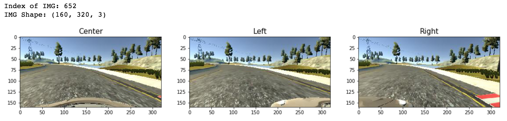
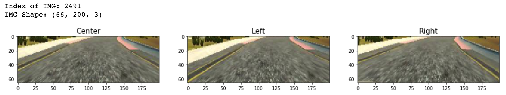
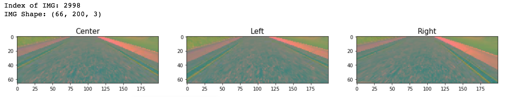
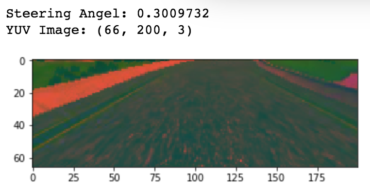

# **Behavioral Cloning** 
[](http://www.udacity.com/drive)

---

**Behavioral Cloning w/ CNN Deep Learning Model (Keras)**

The aim of this project is cloning car driving behavior with CNN deep learning model with various tools and techniques in order to drive around tracks without leaving the road. This is supervised training model between car steering angles and road images in front of a car, [center, left, right].
* Deep Learning Model: [NVIDIA CNN Model](https://devblogs.nvidia.com/deep-learning-self-driving-cars/) with Keras
* Language: Python, [Keras](https://keras.io/)
* Data: Collect Images & Steering Angles with good driving behavior from [Unity simulator](https://unity3d.com/)
    - Unity Simulator is made from [Udacity CarND Class](https://github.com/udacity/CarND-Behavioral-Cloning-P3)
    - Collect Image - In three diffrent angle, [Center, Left, Right]
    - Steering Angels - Each image has a single Angle for Center image
    - 80% of Traing Set & 20% of Validate Set
* Hardware: AWS g2.2xlarge (GPU)

---
### Files Description
* `model.py` : Containing the script to create and train the model include pre-processing for input data set.
* `drive.py`: For driving the car in autonomous mode with the trained model.
* `model.h5`: Containing a trained convolution neural network
* `Behavioral_Cloning_notebook.ipynb`: model.py ipython format include example image for pre-processing

---

### Quick Start
##### Install required python libraries:
In order to run the code, it has to be set environment. 
Using [anaconda](https://www.continuum.io/downloads) or [miniconda](https://conda.io/miniconda.html) to set environment.

```python
# Use TensorFlow with GPU
conda env create -f environment.yml 

# Install manually
pip install <package_name>
conda install <package_name>
```

##### Test Autonomous Driving with Trained Model

Start up [Udacity carND simulator](https://github.com/udacity/self-driving-car-sim), and Click the Autonomous Mode button.
```python
# In Terminal
python drive.py model.h5
```

##### Train New Model

It requires training data in `./data/` folder.

```python
# In Terminal
python model.py

# In Jupyter Notebook
jupyter notebook ./Behavioral_Cloning_notebook.ipynb
```
---
### **The steps of this project are the following:**

#### Step 1: Data Load & Summary

Collect the dataset with good driving behavior from [Unity Simulator](https://github.com/udacity/CarND-Behavioral-Cloning-P3), saved as driving_log.csv. 
This dataset consists of  7 columns, [center, left, right, steering, throttle, brake, speed].
**This simulator has three cameras in front of the car to collect images from different angles, `Center`, `Left`, `Right`. [model.py lines 19-39]


* This DataSet contains four Keys and Values for Train the Model:
  - **center:** Center camera Image, (160, 320, 3) shape
  - **left:** Left camera Image, (160, 320, 3) shape
  - **right:** Right camera Image, (160, 320, 3) shape
  - **steering:** Steering Angle, radian values based on center image

* Split Training & Test Set:
    - **Training Set, 80%:** 6428 Images, 160x320, RGB Color
    - **Validation Set, 20%:** 1608 Images, 160x320, RGB Color

* Visualization of the dataset:<br>
    - **Sampling Images from Training Dataset:**
        <br />

    - **Statistic for Training Dataset:**
		 <br />

---
#### Step 2: Data Preprocessing
##### Crop, Resize and Convert Color RGB to YUV
The top portion of the image captures trees and hills and sky, and the bottom portion of the image captures the hood of the car. During the model training, it might be faster if each image crop to focus on only the portion of the image that is useful for predicting a steering angle. In addition, the training images need to do pre-process into the best shape and color-type for NVIDIA model, [RGB](https://en.wikipedia.org/wiki/RGB_color_model) to [YUV](https://en.wikipedia.org/wiki/YUV). [model.py lines 41-51]<br>
- **Crop:** remove top 68, bottom 23 pixels<br>
- **Resize:** (160, 320, 3) -> (66, 200, 3), which is input shape for NVIDIA model<br>
    <br />
- **Convert Color:** RGB to YUV<br>
    <br />

##### Generate Train Image
Training model with unbalanced dataset makes more bias in particular classes/labels after creating/training CNN model. It is necessary to make balanced dataset before train the CNN model to get the best accuracy. Also, balanced and enough training data set automatically tune parameter for CNN model. In order to make balanced dataset, it requires some techniques such as image Translation and Flip.<br>

In the real world, there is various conditions exist such as shadow, cloud, rain or sunny. Therefore, I add some techniques, shadowing and [adjust_gamma](https://en.wikipedia.org/wiki/Gamma_correction), to provide a various condition of images based on brightness and contrasts. [model.py lines 51-124]<br>

- **Flip:** Flipt the image left <-> right, and adjust the steering angle. 
   
    |Orignal Image | Flipped Image|
    |:------------:|:------------:|
    |||
    
- **Translate:** Translate the image in random (X: [-30.0, 30.0], Y: [-5.0, 5.0]) coordinate, and adjust the steering angle.
   
    |Orignal Image   | Translated Image|
    |:--------------:|:--------------:|
    |||
    
- **Adjust Gamma:** Adjust gamma value to change a brightness of image OpenCV provides Color map, but changing the only brightness with gamma needs to make own color map. The table is from Google search, mapping the pixel values [0, 255] to adjust gamma values.
   
    |Orignal Image | Adjusted Image|
    |:------------:|:------------:|
    |||

- **Make Shadow:** Make shadow on the images in randomly chosen locations with a line. The line is made by randomly chose two points, and choose above/blow area to make a shadow. By using mathematical function, (ym-y1)*(x2-x1) - (y2-y1)*(xm-x1) > 0.
   
    |Orignal Image | Shadow Image |
    |:------------:|:------------:|
    |||

##### Python Generator
For training, the following augumentation technique with Python generator to generate unlimited number of images in randomly choose index number from the train image set: [model.py lines 126-173]<br>
ex) **Image** - `X_train[index]` / **Steering Angle** - `y_train[index]`

* Randomly choose from `['center', 'left', 'right']` images in weight of `[0.3, 0.35, 0.35]` because distribution of images skewed with straight roads (steering angle == 0.0), so choosing left `(steering angle += 0.2)` and right `(steering angle -= 0.2)` in higher rate might help to figure out unblanced input data
* About 80% of chance to generate images with `[flip, translate, shadowing, adjust_gamma]` functions. 

> The training dataset is balanced with python generator. This preprocess is include generate data with some techniques [flip, translate, shadowing, adjust_gamma], and Crop, Resize, Convert Color RGB to YUV and shuffling.<br>
In addition, for using left/right images is very useful for training model. It might recover limited driving scenario. 
---

#### Step 3: Design a Model Architecture, NVIDIA Model 

The NVIDIA Behavioral Cloning Model designed and implemented a CNN deep learning model, trained by almost 8,000 images of camera images and steering angles.<br>
The training dataset seems like the small size, but augmentation technique with Python generator can generate an unlimited number of images, so it can figure out a small number of the train set. [model.py lines 175-202]<br>
<br />

Model consisted of the following layers:

|Layer     |Functions      	|     Description	                     |
|:--------:|:------------------:|:------------------------------------------:| 
|Input     |          	     	| 66x120x3 YUV image   			     |
|Lambda    | Normalization      | Image/127.5 - 1.0                          |
|Conv1     | Convolution 5x5    | 2x2 Stride, 24 filter                      |
|Conv1-Act | ELU		| Activation Function   	             |
|Conv2     | Convolution 5x5    | 2x2 Stride, 36 filter                      |
|Conv2-Act | ELU		| Activation Function                        |
|Conv3     | Convolution 5x5    | 2x2 Stride, 48 filter                      |
|Conv3-Act | ELU	        | Activation Function   		     |
|Conv4     | Convolution 3x3    | 1x1 Stride, 64 filter                      |
|Conv4-Act | ELU		| Activation Function   	             |
|Conv5     | Convolution 3x3    | 1x1 Stride, 64 filter                      |
|Conv5-Act | ELU		| Activation Function   		     |
|Dropout   | 50% Drop Out       | Avoid over fitting                         |
|FC1       | Fully Connected	| Output 100, Activation: ELU                |
|FC2       | Fully Connected	| Output 50, Activation: ELU   		     |
|FC3       | Fully Connected	| Output 10, Activation: ELU   	             |
|FC4       | Fully Connected	| Output 1, Steering Angle 		     |
<br />

The shapes and the number of parameters: Keras

| Layer (type)                   |Output Shape      |Param # |Connected to     |
|:------------------------------:|:----------------:|:------:|:---------------:|
|lambda_1 (Lambda)               |(None, 66, 200, 3)|0       |lambda_input_1   |
|convolution2d_1 (Convolution2D) |(None, 31, 98, 24)|1824    |lambda_1         |
|convolution2d_2 (Convolution2D) |(None, 14, 47, 36)|21636   |convolution2d_1  |
|convolution2d_3 (Convolution2D) |(None, 5, 22, 48) |43248   |convolution2d_2  |
|convolution2d_4 (Convolution2D) |(None, 3, 20, 64) |27712   |convolution2d_3  |
|convolution2d_5 (Convolution2D) |(None, 1, 18, 64) |36928   |convolution2d_4  |
|dropout_1 (Dropout)             |(None, 1, 18, 64) |0       |convolution2d_5  |
|flatten_1 (Flatten)             |(None, 1152)      |0       |dropout_1        |
|dense_1 (Dense)                 |(None, 100)       |115300  |flatten_1        |
|dense_2 (Dense)                 |(None, 50)        |5050    |dense_1          |
|dense_3 (Dense)                 |(None, 10)        |510     |dense_2          |
|dense_4 (Dense)                 |(None, 1)         |11      |dense_3          |
|                                |**Total params**  |252,219 |                 |
<br />
> For this model, designed 10 Big layers - 1 Lambda Layer for Normalization, 5 Convolution layers and 4 fully connected layer. Each convolution and fully connected layer includes 1 activation function, ELU.
In order to avoid overfitting, there is 50% dropout fuction applied between convolution layer and fully connected layer.
---

#### Step 4: Training and Evaluation Model
##### Training Model
- **Hardware:** AWS g2.2xlarge (GPU)
- **Loss Fuction:** Mean Squared Error (MSE), gap between y_hat and y
- **Optimizer:** Adam optimizer
- **Learning Rate:** 1.0e-4
- **Epochs:** 8, it is a good enough
- **Samples_per_epoch:** 20,000, unlimited number of images agumented by python generator
- **Batch_size:** 40, there is memory issue
<br />

**Model Evaluation**<br>
<br>
<br />
First, I tried 1.0e-3(default) as learning rate, but it converged too fast and stop to reduce loss. Therefore, I changed into 1.0e-4 as learning rate.<br>
I set the model check-point with Keras [Callback.ModelCheckpoint](https://keras.io/callbacks/) function, so I can save the best model based on validation loss every epoch.<br>
From the check-point, the model reaches enough accuracy after 5-8 epochs, so I modified to 8 epochs in the final version of this project.<br>

---

### **Conclusion**
#### **Review All Process**
Train NVIDIA Model with collected image dataset from Unity Simulator.
 - `Step 1:` Collect Data and Load - 3 side of images, steering angle  
 - `Step 2:` Data Preprocessing - Generate (Balancing Train Set), Crop, YUV, etc
 - `Step 3:` Using NVIDIA Model Architecture (CNN)
 - `Step 4:` Training and Evaluation Model

#### **Results**
The trained model successfully drives around track one without leaving the road.
 - `Train Set Accuracy:` 99.1%
 - `Valid Set Accuracy:` 96.1%


---
