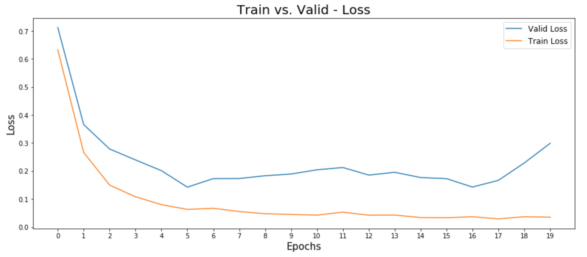

# **Traffic Sign Recognition** 

---

**Traffic Sign Classification w/ CNN Deep Learning Model (Tensorflow)**

The aim of this project is developing image classification model (CNN) with various tools and techniques in order to detect Traffic Signs.
* Deep Learning Model: [Convolutional neural network
](https://en.wikipedia.org/wiki/Convolutional_neural_network) 
* Language: Python, [Tensorfolw](https://www.tensorflow.org/) (GPU support version)
* Training Data: [German Traffic Sign](http://benchmark.ini.rub.de/?section=gtsrb&subsection=dataset)
* Hardware: AWS g2.2xlarge (GPU)

---
### **The steps of this project are the following:**

#### Step 1: Data Load & Summary

Download the dataset, German Traffic Sign, from [Here](https://d17h27t6h515a5.cloudfront.net/topher/2017/February/5898cd6f_traffic-signs-data/traffic-signs-data.zip). This dataset pickled and resized already by the size of 32x32.

* There is three pickle format, `.p`, files:
    - **Training Set,** `train.p`: 34799 Images, 32x32, BGR Color - (32, 32, 3)
    - **Validation Set,** `valid.p`: 4410 Images, 32x32, BGR Color - (32, 32, 3)
    - **Testing Set,** `test.p`: 12630 Images, 32x32, BGR Color - (32, 32, 3)

* This pickled DataSet contains four Keys and Values:
  - **Image Features:** 4D Array, (# of images, Width, Height, Channels)
  - **Label:** 1D Array, 43 Classes/labels for each images
  - **Sizes:** Tuples, Original size of image, (Width, Height)
  - **Coords:** Tuples, coordinates each corner, (x1, y1, x2, y2)

* Visualization of the dataset: 
    - **Sampling Images from Training Dataset:**
         

    - **Statistic for Training Dataset:**
		  

---
#### Step 2: Data Preprocessing

Training model with unbalanced dataset makes more bias in particular classes/labels after creating/training CNN model. It is necessary to make balanced dataset before train the CNN model to get the best accuracy. Also, balanced and enough training data set automatically tune parameter for CNN model. In order to make balanced dataset, it requires some techniques such as image Projection and Rotation.

The contrast and brightness of images in each class/label are different in this Dataset, German Traffic Sign. This is not really a great training dataset for highly accuracy CNN model. There is a technique, [Histogram Equalization](https://en.wikipedia.org/wiki/Histogram_equalization), to increases contrasts for lower contrast image. This technique might applied for train dataset.

1. **Generate images:** Make more images around 8000 images in each class/label 
    - **Translation:** Translating images in random (X, Y) coordinate, between -5.0 and 5.0
		  
    
    - **Rotation:** Rotating images in random angles, between -15.0 and 15.0 degrees.
    	 
    
    - **Affine-Transformation:** Transformating images in random (X1, Y1, X2, Y2) coordinate (4 corner points) between -5.0 and 5.0 
    	 

2. **Grayscaling:** Converting an BGR image into Grayscale image with [cv2.cvtColor()](https://docs.opencv.org/2.4/modules/imgproc/doc/miscellaneous_transformations.html). Then apply [Histogram Equalization](https://en.wikipedia.org/wiki/Histogram_equalization) into images with [cv2.equalizeHist()](https://docs.opencv.org/3.1.0/d5/daf/tutorial_py_histogram_equalization.html)

3. **Normalization:** Normalization with (pixel - 128)/128
4. **Shuffling:** Ramdomly shuffle images and classes/labels in the same order

5. **Statistic for Training Dataset after Pre-Process:**
	 

> The training dataset is balanced after preprocess, each class/label have around 8000 images. This preprocess is include generate fake data with [translation, rotation, affineTrans], Normalization, BGR to Grayscale, Histogram Equalization, and Shuffling.
---

##### Step 3: Design a Model Architecture, named as Traffic_Net

The Germen Traffic Sign Recognition Model designed and implemented a CNN deep learning model, trained by almost 350,000 images of Germen Traffic Sign.

 

Final model consisted of the following layers:

|Layer     |Functions      		|     Description	        			     |
|:--------:|:------------------:|:------------------------------------------:| 
|Input     |          	     	| 32x32x1 Grayscale image   			     | 
|Conv1     | Convolution 5x5    | 1x1 Stride, Same Padding, Outputs 32x32x32 |
|Conv1-Act | RELU				| Activation Function   				     |
|Conv1-Pool| Max pooling	    | 2x2 Stride,  Outputs 16x16x32, **Dropout 0.9|
|Conv2     | Convolution 5x5    | 1x1 Stride, Same Padding, Outputs 16x16x64 |
|Conv2-Act | RELU				| Activation Function   				     |
|Conv2-Pool| Max pooling	    | 2x2 Stride,  Outputs 8x8x64,  Dropout 0.8  |
|Conv3     | Convolution 5x5    | 1x1 Stride, Same Padding, Outputs 8x8x128  |
|Conv3-Act | RELU				| Activation Function   				     |
|Conv3-Pool| Max pooling	    | 2x2 Stride,  Outputs 4x4x128, Dropout 0.7  |
|Pre-FC    | Flatten        	| ***2048+1024+512 = 3584, Output 3584        |
|FC1       | Fully Connected	| Output 1024,  Dropout 0.5   				 |
|FC2       | Softmax			| Output 43, Classes/Labels 		   		 |
** [Dropout](https://en.wikipedia.org/wiki/Dropout_(neural_networks)) is a regularization technique for reducing overfitting in neural networks by preventing complex co-adaptations on training data.
*** Make Flat np.Array with [tf.contrib.layers.flatten()](https://www.tensorflow.org/api_docs/python/tf/contrib/layers/flatten):
4x4 Stride Max Pool from Conv1 (512) +  2x2 Stride Max Pool from Conv2 (1024) + 2x2 Stride Max Pool from Conv3 (2048) = 3584 as Input Fully Connected Layer.
---
##### Step 4: Training and Evaluation Model, named as Traffic_Net

 

 

 
**Traffic_Net Model Evaluation**

 

 
From the Accuracy graph, the Traffic_Net model reaches enough accuracy after 20 epochs.

---

##### Step 5: Test Model, named as Traffic_Net, with New Image from Google

This is the step for predicting images from new input images, German traffic signs from Google search to test model performance. There is [Softmax function](https://developers.google.com/machine-learning/crash-course/multi-class-neural-networks/softmax), [tf.nn.softmax()](https://www.tensorflow.org/api_docs/python/tf/nn/softmax),  applied at the last of CNN Deep Learning model. 
**Number of new Testing Examples/Images: 6 Images

 

 

Here are the results of the prediction:

| Test Image from Google Search        |     Prediction	        	          |  
|:------------------------------------:|:------------------------------------:| 
| Priority road  		               | Priority road					      | 
| Speed limit (20km/h)                 | Speed limit (20km/h)			      |
| Yield					               | Yield							      |
| Speed limit (70km/h)	               | Speed limit (70km/h)		    	  |
| Stop 		                       	   | Stop 			                      |
| Right-of-way at the next intersection| Right-of-way at the next intersection|
The model was able to correctly guess 6 of the 6 German Traffic Signs, which gives an accuracy of 100%.

**Prediction Results Top 5 Softmax**
Using [tf.nn.top_k()](https://www.tensorflow.org/api_docs/python/tf/nn/top_k), I can get top 5 prediction images from result of probabilities, Softmax output.

 

**#1 Image: Priority road**
| Probability         	|     Prediction	        	| 
|:---------------------:|:-----------------------------:| 
| 1.0         			| Priority road   				| 
| .00     				| Speed limit (20km/h)			|
| .00					| Speed limit (30km/h)			|
| .00	      			| Speed limit (50km/h)          |
| .00				    | Speed limit (60km/h)   		|

**#2 Image: Speed limit (20km/h)**
| Probability         	|     Prediction	        	| 
|:---------------------:|:-----------------------------:| 
| 1.0         			| Speed limit (20km/h)			| 
| .00     				| Speed limit (120km/h)			|
| .00					| Stop			                |
| .00	      			| Wild animals crossing         |
| .00				    | Double curve                  |

**#3 Image: Yield**
| Probability         	|     Prediction	        	| 
|:---------------------:|:-----------------------------:| 
| 1.0         			| Yield         				| 
| .00     				| End of no passing  			|
| .00					| Speed limit (80km/h)			|
| .00	      			| Speed limit (60km/h)          |
| .00				    | Priority road         		|

**#4 Image: Speed limit (70km/h)**
| Probability         	|     Prediction	        	| 
|:---------------------:|:-----------------------------:| 
| 1.0         			| Speed limit (70km/h)   		| 
| .00     				| Speed limit (120km/h)			|
| .00					| Stop			                |
| .00	      			| Roundabout mandatory          |
| .00				    | Speed limit (80km/h)   		|

**#5 Image: Stop**
| Probability         	|     Prediction	        	| 
|:---------------------:|:-----------------------------:| 
| 1.0         			| Stop          				| 
| .00     				| Speed limit (60km/h)			|
| .00					| Speed limit (50km/h)			|
| .00	      			| Speed limit (120km/h)         |
| .00				    | General caution   		    |

**#6 Image: Right-of-way at the next intersection**
| Probability         	|     Prediction	        	| 
|:---------------------:|:-----------------------------:| 
| 1.0         			| Right-of-way at the next intersection| 
| .00     				| General caution   			|
| .00					| Road work         			|
| .00	      			| Double curve                  |
| .00				    | Dangerous curve to the left   |

---
### **Conclusion**
###### **Review All Process**
Train CNN Deep Learning Model with German Traffic Sign Dataset in order to recognize Traffic Sign Images.
> `Step 1:` Data Load - Pickle format
> `Step 2:` Data Preprocessing - Generate (Balancing Train Set), Gray, etc
> `Step 3:` Design a Model Architecture (CNN), named as Traffic_Net 
> `Step 4:` Training and Evaluation Model
> `Step 5:` Test Model with New Image from Google

###### **Results**
The model accracy can reach to more than around 95% after nearly 10 epochs, so this CNN, Traffic_Net model trained with 20 epochs.
> `Train Set Accuracy:` 99.1%
> `Valid Set Accuracy:` 96.1%
> `Test Set Accuracy:` 94.1%
> `New Test Set Accuracy:` 100.0%

Next step will restore and retrain this CNN, Traffic_Net model, with tunning hyper-parameter such as learning rate (0.001 for this model).