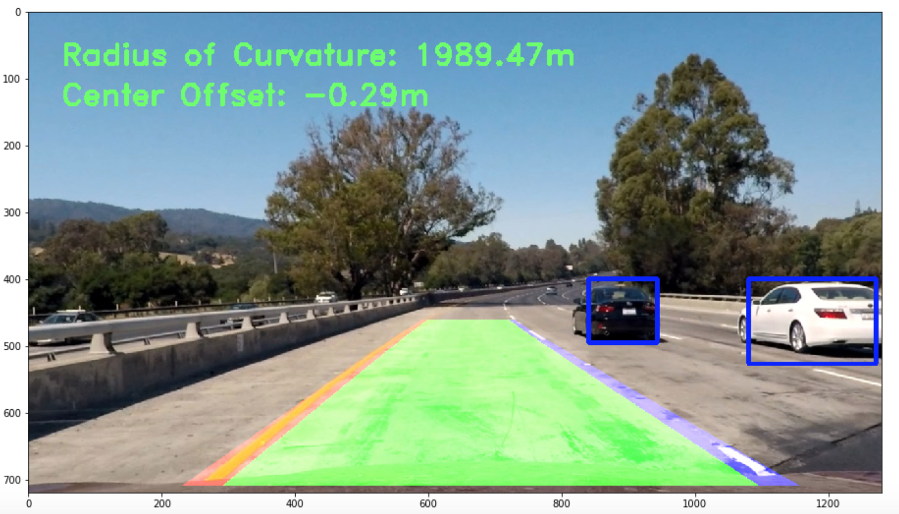
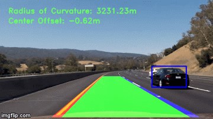

# **Vehicle Detection Tracking** 
[](http://www.udacity.com/drive)

---

##### **Vehicle Detection Tracking Project**

The aim of this project is to develop a pipeline to detect cars on the road with the video stream from the forward facing camera. <br>
* Language/Library: Python, [OpenCV](https://opencv.org/), Numpy, [MoviePy](http://zulko.github.io/moviepy/)
* Data: Vidoe Stream from Camera mounted on the front of Car (mp4)
* Output: Video File (mp4)
  - The Detected Cars, Rectangle detection in real-time
  - The Detected Lane Lines, color shaded
  - The radius of Curvature of the Road
  - Center Offset, the location of the vehicle from the center of the lane

<br />

---
**The goals/steps of this project are the following:**

* Perform a Histogram of Oriented Gradients (HOG) feature extraction on a labeled training set of images and train a classifier Linear SVM classifier
    - Optionally, you can also apply a color transform and append binned color features, as well as histograms of color, to your HOG feature vector. 
    - Note: for those first two steps don't forget to normalize your features and randomize a selection for training and testing.
* Implement a sliding-window technique and use your trained classifier to search for vehicles in images.
* Run your pipeline on a video stream (start with the test_video.mp4 and later implement on full project_video.mp4) and create a heat map of recurring detections frame by frame to reject outliers and follow detected vehicles.
* Estimate a bounding box for vehicles detected.

---
### **The steps of this project are the following:**
#### Step 1: Load Data
Download the labeled dataset for Car and Non-Car. Here are the links for [Car](https://s3.amazonaws.com/udacity-sdc/Vehicle_Tracking/vehicles.zip) and [Non-Car](https://s3.amazonaws.com/udacity-sdc/Vehicle_Tracking/non-vehicles.zip). This dataset `.png` format and the size of 64x64 with RGB color channels.

* There is two label, Car/Non-Car:
    - **Car :** 8792 Images, 64x64, RGB Color - (64, 64, 3)
    - **Non-Car :**  8968 Images, 64x64, RGB Color - (64, 64, 3)

##### Car Images <br>
<br />
##### Non-Car Images <br>
<br />
		
		
#### Step 2: Compute Gradient for Future Extraction by HOG Function
In this step, features extraction from the images, Car and Non-Car images, by using HOG (Histogram of Oriented Gradients). The [HOG](http://scikit-image.org/docs/dev/auto_examples/features_detection/plot_hog.html) function makes histogram of the direction of oriented gradients in X and Y. <br> 
Since the result contains magnitude and direction of gradients, it is really useful to classify between the car and non-car images.

- **Image -> HOG Image/HOG Feature**
    - Compute the gradient image in X and Y.
    - Compute gradient histograms.
    - Normalize across blocks.
    - Flattening into a feature vector.

##### Car HOG Images <br>
<br />
##### Non-Car HOG Images <br>
<br />

- **Find the Best Parameters for HOG - Tune Parameter** <br>
    ```python
    colorspace = ['RGB', 'HSV', 'LUV', 'HLS', 'YUV', 'YCrCb']
    orient = [8, 9, 10, 11, 12]
    pix_per_cell = [8, 16]
    cell_per_block = 2
    hog_channel = [0, 'All']
    ```
    >There are 120 different possible set of params. <br>This step is to find the
    best set of params in the accuracy score of SVC based on in different set of
    params(`colorspace`, `orientations`, `pix_per_cell`, `hof_channel`). <br>
    One params, `cell_per_block`, is fixed value in `cell_per_block = 2`. And 
    the param, `hog_channel`, has two options `hog_channel = 'All'` or
    `hog_channel = 0`, which is only one channel applied.
    
##### Top 10 Set of Param based on Accuracy Score<br>
<br />  


** `hog_channel` applied as `'All'` when the extraction only HOG feature from the image. <br>
   `hog_channel` applied as `'0'` when the extraction combined HOG feature and Color feature.

**Based on the result, I choose top 5 set of param and play around with combine feature extraction by HOG features and Color features. Then, I choose for final set of params as `colorspace = 'LUV'`, `orient = 8`, `pix_per_cell = 8`, `cell_per_block = 2`, `hog_channel = 0`.


---
#### Step 3: Linear SVM Classification w/ Combined Features
This step is training a linear [Support Vector Machine (SVM)](https://en.wikipedia.org/wiki/Support_vector_machine) by using combined feature, HOG feature from the Best params and Color features. <br>
- **Image -> Color Features**
    - Compute binned color features.
    - Compute the histogram of the color channels separately and concatenate.
    - Flattening into a feature vector for color.<br>
    <br />  
- **Image -> Color Features + HOG Features**
    - Compute HOG features.
    - Compute color features.
    - Make combined one flatten feature vector.
    - Scaling features with [`StandardScaler()`](http://scikit-learn.org/stable/modules/generated/sklearn.preprocessing.StandardScaler.html)

```python
# Feature extraction parameters
Color_space = 'LUV'
Orientation = 8
Pixel_per_Cell = (8, 8)
Cell_per_Block = (2, 2)
Hog_Channel = 'All'
Spatial_Size = (16, 16)
Hist_bins = 32
```
- **Color Features + HOG Features -> Train a linear SVM**
```python
# Split train and test data, 80% of Train_set and 20% of Test_set
Xtr, Xte, ytr, yte = train_test_split(scaled_X, y, test_size=0.2)

# Use Linear SVC, Linear Support Vector Classification
svc = LinearSVC()                                
svc.fit(Xtr, ytr)

# Check the score of the SVC
score = svc.score(Xte, yte)                     
```

##### SVM Training Result <br>
<br />

---
#### Step 4: Find Vehicles on the Image by Sliding Window Search
In this step, it allows searching a vehicle in a desired region of the frame with the desired window size (64x64 pixels - this is the same size of training images).<br>
* It doesn't need to search all pixels, so set specific region of the image or frame.
* The window slide to the left and overlap with the previous window, I set a 75% overlap. 

```python
# Sliding Window Search
Region Y = (400, 656), out of (0, 720) pixels
Region X = (0, 1280), all X pixels
Window Overlap = 75%
Window Size = (64, 64), (96, 96), (128, 128), (160, 160)
```

##### Detect Vehicles w/ Sliding Window Search  <br>
<br />


---
#### Step 5: Heatmap Filtering and Smoothing
In this step, making smooth detection windows (boxes) by using heatmap filter and thresholds to remove false positives. <br>
From the result Sliding Window Search, there are some overlapping windows (boxes). These results are classified as True Positive and False Positive ([Confusion Matrix](https://www.dataschool.io/simple-guide-to-confusion-matrix-terminology/_)).<br>

In order to identify True Positive windows (Detected Vehicle), I used heatmap based on the number of overlapped windows (boxes), then apply threshold in the heatmap. The library, [`scipy.ndimage.measurements.label()`](https://docs.scipy.org/doc/scipy-0.16.0/reference/generated/scipy.ndimage.measurements.label.html), help to draw heatmap.<br>

##### Windows Detection + Heatmap + Threshold**  <br>
<br />


---
#### Step 6: Combine with Advanced Lane Finding Project
In this step, applying two pipelines to detect lane lines and vehicles on the road with the video stream from the forward facing camera. A single image/frame go through the lane line detection pipeline, then apply filtered set of windows(boxes - detection of vehicles) by using Vehicle Detection pipeline. [(`Advanced Lane Finding Project`)](https://github.com/yunsupj/SDC_Project/tree/master/Computer_Vision/Advanced_Lane_Finding)<br>

##### The Final Result from Two Pipelines - Lane Line Detection & **  Vehicle Detection<br>
<br />


---
#### **Video Processing Results**
Above practice is a pipeline for the image Vehicle Detection process. However, the main purpose of this project is expanding the pipeline for videos, which recorded from a mounted camera, like real-time Vehicle detection.

The [`VideoFileClip()`](https://zulko.github.io/moviepy/_modules/moviepy/video/io/VideoFileClip.html) from the moviePy library can help to separate frame-by-frame from the video stream, so we can use the image lane line detection pipeline for real-time Vehicle detection.

|Result Video |Result Video |
|-------------|-------------|
|||

---
#### **Discussion**
The main pipeline is perfectly work in various conditions of views. The pipeline can accurately map out the true location of the vehicles, and it does not fail on multiple cars detection or remove false positive detections. However, since the vehicles in another side of the road usually smaller than the vehicles on the same side of the road, it is hard to detect after apply heatmap filter and thresholds. I think it may need smaller window size when search image/frame with sliding window to detect all the vehicles on both sides of the roads, which will require a lot more time to process.